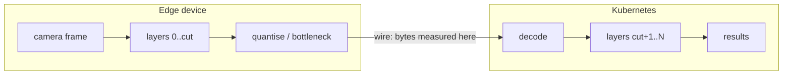

# splitflow

[](https://github.com/dantonioluigi/yolo-split-computing/actions/workflows/ci.yml)
[](LICENSE)


**Split inference for vision models, from the first measurement to a Kubernetes
deployment.** Cut a network in two, run the first half on the edge device, ship
*quantised intermediate tensors* instead of frames, and finish inference in the
cloud — with the bandwidth, latency and accuracy costs measured, not assumed.

```python
from splitflow import SplitModel, Int8Transport

model = SplitModel(YOLO("yolo11l.pt").model)   # any adapted model
model.plan(bandwidth_mbps=50, fps=10)          # pick the cut for the link
model.split(transport=Int8Transport(compress=True))
detections = model.run(frame)                  # edge → wire → cloud
cr = model.deploy(name="detector", image="ghcr.io/you/cloud:0.6.0",
                  model_url="https://store/model.pt")   # kubectl apply this
```



## Why it is not a `model[:k]` slice

A neck consumes several backbone taps through skip connections — in YOLO11,
layers 4, 6 and 10 — so a naive sequential slice silently drops tensors the
cloud half still needs. splitflow resolves the model graph, computes the exact
*wire set* for any cut point, and runs the two halves so the split output is
**bit-identical** to the unsplit model (verified in the test suite).

Which layers exist and how to run them comes from a small **adapter contract**
(`graph` / `default_cut` / `probe_shapes` / `run_span`), so the planner, codecs,
wire protocol, policy and operator are architecture-agnostic. Ultralytics is the
first adapter; a new model family is a registration, not a fork.

## Install

```bash
git clone https://github.com/dantonioluigi/yolo-split-computing
cd yolo-split-computing
python -m venv .venv && source .venv/bin/activate
# CPU-only torch keeps the venv small; skip this line on machines with CUDA/Jetson
pip install torch torchvision --index-url https://download.pytorch.org/whl/cpu
pip install -e ".[dev]"
```

## Usage

**1. Inspect the architecture and price every cut point** (works with a `.pt`
checkpoint or a bare model YAML):

```bash
splitflow inspect --model yolo11l.pt --imgsz 640
```

Prints the layer graph (with resolved skip connections) and, for every candidate
cut, which tensors must cross the wire and their fp32/fp16/int8 sizes.

**2. Measure bandwidth on real frames** — JPEG at production quality vs the
wire set produced by the edge half on the *same letterboxed pixels*:

```bash
splitflow measure --model yolo11l.pt --images path/to/images/val \
    --quality 85 --json results/measure.json
```

**3. Measure the accuracy cost** — full validation twice on the same dataset,
unsplit vs split+INT8:

```bash
splitflow evaluate --model yolo11l.pt --data data.yaml \
    --transport int8 --per-channel --json results/eval.json
```

**4. Train the learned bottleneck** — the piece that closes the ~30x gap. A
small per-level autoencoder is trained by feature distillation (detector
frozen, simulated INT8 noise on the latents); with the defaults
(`--latent-channels 8 --stride 2`) the INT8 latent is ~17 KB/frame vs ~47 KB
of JPEG q85:

```bash
splitflow train-bottleneck --model yolo11l.pt \
    --images path/to/images/train --device 0 --out bottleneck.pt
splitflow evaluate --model yolo11l.pt --data data.yaml \
    --bottleneck bottleneck.pt --json results/eval_bottleneck.json
```

No GPU locally? [notebooks/colab_validation.ipynb](notebooks/colab_validation.ipynb)
runs this on COCO (train2017 → val2017) on a free Colab GPU.

**5. Simulate the adaptive stream** — the edge runs the detector locally and
per frame ships only what the frame deserves: serialised boxes (11 bytes per
detection) when confident, (bottlenecked) features when uncertain, the full
JPEG on drift or low confidence — which is also enqueued as a hard-frame
sample for later use:

```bash
splitflow stream --model yolo11l.pt --images path/to/images/val \
    --bottleneck bottleneck.pt --json results/stream.json
```

**6. Benchmark a configuration** — accuracy, throughput, bandwidth and latency
only mean something together: a cut that halves the bytes is worthless if it
doubles the edge latency. One command reports them per stage:

```bash
splitflow benchmark --model yolo11l.pt --images path/to/frames \
    --transport int8 --compress --device 0 --json results/bench.json
# add --data data.yaml to also measure the mAP cost (slower)
```

```
| metric                  | value          |
| latency total           | 295.0 ms       |
|   · edge half           | 94.6 ms        |
|   · wire (encode+codec) | 104.2 ms       |
|   · cloud half          | 93.6 ms        |
| throughput              | 3.4 FPS        |
| wire                    | 577.7 KB/frame |
| wire vs JPEG            | 0.17x          |
| bandwidth needed        | 16.0 Mbps      |
```

Power is included on boards that expose it (Jetson INA3221 rails).

Everything is also available as a library:

```python
from ultralytics import YOLO
from splitflow import SplitRunner, Int8Transport, split_inference

yolo = YOLO("yolo11l.pt")
runner = SplitRunner(yolo.model, transport=Int8Transport(axis=1))
detections = runner(x)                  # edge -> quantise -> wire -> cloud
print(runner.stats.mean_bytes)          # bytes/frame that crossed the wire

with split_inference(yolo.model, transport=Int8Transport()) as runner:
    yolo.val(data="data.yaml")       # standard ultralytics val, split underneath
```

## Run it split, over the network

The cloud half runs as a service; the edge half connects to it. A HELLO/ACK
handshake exchanges the weight fingerprints of both halves and the cut point,
so an edge and a cloud running different weights are rejected at connect time
instead of silently producing wrong results.

```bash
# cloud (a K8s pod, or just another host)
splitflow serve --model yolo11l.pt --bottleneck bottleneck.pt --port 9095

# edge (Jetson, laptop, anything with the same weights)
splitflow edge --model yolo11l.pt --bottleneck bottleneck.pt \
    --host <cloud-host> --port 9095 --images path/to/frames
```

The wire protocol carries three payload kinds — serialised detections,
quantised (bottlenecked) feature tensors, and full JPEG frames — chosen per
frame by the adaptive policy. FRAME uploads can be queued as hard-frame
samples with `serve --retrain-dir /retrain`.

## Deploy on Kubernetes

`deploy/` ships Dockerfiles for both halves and a Helm chart for the cloud
half. The images are model-agnostic (weights are provided at runtime, not
baked in), so a single build serves any checkpoint:

```bash
helm install detector deploy/helm/splitflow-cloud \
    --set image.repository=ghcr.io/you/splitflow-cloud \
    --set model.url=https://your-store/model.pt \
    --set bottleneck.url=https://your-store/bottleneck.pt
```

An initContainer downloads the checkpoint (or mount a PVC via
`model.existingClaim`); the pod exposes the wire port plus `/healthz` and
Prometheus `/metrics` (set `serviceMonitor.enabled=true` with the Prometheus
Operator). Point edge devices at the resulting Service DNS name.

### Operator (declarative)

For fleets, `operator/` provides a `SplitInference` custom resource and a kopf
controller that manages the cloud Deployment/Service and an edge-facing
ConfigMap for you:

```yaml
apiVersion: split.dev/v1alpha1
kind: SplitInference
metadata: { name: detector }
spec:
  model: { url: https://your-store/model.pt }
  bottleneck: { url: https://your-store/bottleneck.pt }
  cut: { mode: auto, auto: { bandwidthMbps: 50, fps: 10 } }
  cloud: { image: ghcr.io/you/splitflow-cloud:0.5.0, replicas: 2 }
```

`cut.mode: fixed` pins a layer; `auto` writes the budget into the edge
ConfigMap for the edge to plan against live (see live re-planning). Install the
CRD + RBAC from `operator/manifests/`, run the operator (image in
`operator/Dockerfile`), and `kubectl apply` the resource. The reconcile logic
is pure and unit-tested; `deploy/kind/e2e.sh` exercises it end-to-end on a kind
cluster (also run in CI).

## Not just YOLO / not just Jetson

The specifics are seams, not assumptions:

- **Model** — a `ModelAdapter` answers four questions (`graph`, `default_cut`,
  `probe_shapes`, `run_span`) and registers a detector; `SplitModel(model)` then
  resolves it automatically. `UltralyticsAdapter` is the first one. Everything
  above the adapter — planner, codecs, wire protocol, policy, operator — never
  sees an architecture.
- **Task** — the wire carries *opaque* result bytes, so a different head plugs
  in by replacing the server's `postprocess` (YOLO NMS is only the default).
- **Edge device** — "edge" is any host that runs the first half and speaks the
  protocol. Jetson is the reference target, but the edge image is plain Python
  and builds for amd64/arm64 alike.
- **Transport** — raw / INT8 / learned bottleneck are pluggable `Transport`
  objects; a new codec is one class implementing the wire round-trip.

## Results

First measurement — a YOLO11l fine-tuned on a private industrial dataset
(4 classes), 12 frames, 640×640,
backbone cut (layer 10, wire set = P3/P4/P5, i.e. layers 4/6/10):

| configuration | wire KB/frame (mean) | vs JPEG q85 |
|---|---:|---:|
| JPEG q85, letterboxed @640 (baseline) | 47.1 | 1.0x |
| fp32 tensors | 16 800 | 357x **larger** |
| fp16 tensors | 8 400 | 178x **larger** |
| INT8 per-tensor | 4 200 | 89x **larger** |
| INT8 per-tensor + zlib | 1 406 | 30x **larger** |

**Finding:** at the backbone cut, naive quantisation does not come close: even
INT8+zlib ships ~30x more bytes than the JPEG the model would otherwise consume.
This confirms the known risk rather than killing the idea — it quantifies the
gap a **learned bottleneck at the cut** has to close (~30x on top of INT8+zlib)
for feature shipping to beat frame shipping. mAP cost of INT8 (via
`splitflow evaluate`) is only worth measuring once a bottleneck
makes the size competitive.

Latency numbers measured off-device are not representative; re-measure on the
Jetson before drawing conclusions about end-to-end delay.

## Roadmap

- [x] Graph-aware splitter, bit-exact split inference (0.1.0)
- [x] INT8 wire + bandwidth/accuracy measurement (0.1.0) → finding: raw INT8
      loses to JPEG by ~30x at the backbone cut
- [x] Learned bottleneck at the cut, trained by feature distillation (0.2.0)
- [x] Adaptive transmission policy + stream simulator with hard-frame queue (0.2.0)
- [x] Cut planner: pick the split point from a bandwidth/FPS budget (0.3.0)
- [x] Bottleneck sweep: bytes-vs-mAP Pareto tooling (0.4.0)
- [x] Real network split + wire protocol + Docker/Helm deploy (0.5.0)
- [x] Live re-planning: bandwidth/load-driven cut selection with hysteresis (0.6.0)
- [x] Kubernetes operator: `SplitInference` CRD, kopf controller, kind e2e
- [ ] Validate: GPU-train the bottleneck, measure the mAP cost (`evaluate --bottleneck`)
- [ ] Backbone-agnostic split: a generic `torch.fx` graph splitter + task heads
      behind an adapter contract, so any torch vision model works — not just YOLO

The full gated plan is in [docs/roadmap.md](docs/roadmap.md); the experimental
method in [docs/experiment-protocol.md](docs/experiment-protocol.md); repo
upkeep in [docs/maintenance.md](docs/maintenance.md).

## Development

```bash
pytest                 # runs with coverage (fails under 85%)
ruff check . && ruff format --check .
pre-commit install     # optional: run the same checks on every commit
```

Tests build YOLO11n from its bundled YAML with random weights — no downloads, no
GPU needed. YOLO11n shares its topology with the larger YOLO11 variants.

## License

[MIT](LICENSE)
