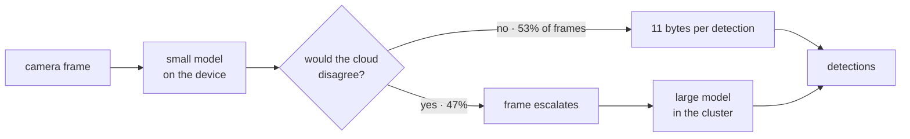

# axonmesh

[](https://github.com/dantonioluigi/axonmesh/actions/workflows/ci.yml)
[](LICENSE)


**An inference decision runtime for edge–cloud AI.**

Serving systems answer *how fast can we serve this request*. axonmesh answers
*whether the request should exist at all* — and proves the answer in bytes and
accuracy before you deploy it.

Two Deployments and a gRPC call move tensors. axonmesh decides whether those
tensors should be sent.



**Half the bandwidth. 98% of the accuracy. Neither model retrained.**

One run, one dataset: yolo11n escalating to yolo11m, coco128 at 320px,
`conf_high=0.6`. 53% of frames answered on the device, 5.43 against 11.16 KB
per frame, mAP50-95 0.440 against 0.448. The threshold is not a guess —
`calibrate` picked it from unlabelled footage.

## Quick start

```bash
pip install -e .          # or: helm install axonmesh-operator deploy/helm/axonmesh-operator

# what threshold fits a 5 KB/frame link? no labels needed
axonmesh calibrate --edge yolo11n.pt --cloud yolo11m.pt --images ./footage --max-kb 5
#   chosen --conf-high 0.60  (4.677 KB/frame, agreement 0.951, escalates 41%)

# cloud: the large model, behind the small one
axonmesh serve --model yolo11n.pt --escalate-to yolo11m.pt --port 9095

# device: answers locally when confident, escalates when not
axonmesh edge --model yolo11n.pt --images ./frames --cascade --statistic mean \
    --host cloud.internal --port 9095
#   24 frames -> 631.6 KB on the wire (always-JPEG 1176.6 KB, saved 46.3%)
```

## What it decides, and with what

| you want to know | run | what you get |
|---|---|---|
| should frames be sent at all? | `cascade` | bytes and mAP for edge-first vs sending everything |
| which frames? | `calibrate` | the threshold meeting your bandwidth or accuracy budget, from unlabelled footage |
| does splitting the model cost accuracy? | `evaluate` | baseline vs split mAP, bytes/frame |
| where would you cut it? | `plan` · `inspect` | every cut priced against a bandwidth/FPS budget |
| what does it cost on the device? | `benchmark` | per-stage latency, FPS, power |
| how big should the codec be? | `sweep` · `allocate` | bytes vs induced output error, Pareto-marked |
| the link quality moves? | `replan` | cut re-selection with hysteresis |
| now run it | `serve` · `edge` | two processes, one TCP link, Prometheus metrics |

Full walkthrough: **[docs/usage.md](docs/usage.md)**.

## Results

Existing systems optimise either bandwidth or accuracy. Pricing one against a
baseline and the other against a different baseline is how a design that loses
looks like one that wins — so everything here is measured on both at once.
Applied to this project's own founding premise, that produced two results, one
of which refutes it.

**Compressing intermediate features loses to sending the frame.** yolo11n at
320px; codec rows trained on COCO val2017 and evaluated on coco128, which share
no images:

| what crosses the wire | KB/frame | mAP50-95 |
|---|---:|---:|
| JPEG q50 frame, cloud runs everything | 11.3 | **0.385** |
| raw INT8 wire tensors | 273 | 0.385 |
| learned bottleneck, 8 latent channels | 3.8 | 0.154 |
| learned bottleneck, 32ch, measured allocation | 14.1 | 0.195 |

At a JPEG-comparable rate the codec ships *more* bytes and returns half the
accuracy. `inspect` shows why in one screen: across all 23 cuts of YOLO11n the
smallest wire set is 100 KB as INT8 against 11 KB for the coded frame — no cut
of the network is smaller than the image it came from. Longer training, 50x the
data, 4x the latent width and a measured bit allocation were each tried and each
quantified; none of them close it.

**Not sending anything wins instead.** Against the honest alternative — keep
sending every frame, just send a worse one:

| KB/frame | cascade | JPEG-quality-only |
|---:|---:|---:|
| 0.04 | **0.385** | — (no frame fits) |
| ~3.2 | **0.412** | 0.048 |
| ~5.0 | **0.440** | 0.152 |
| ~11.2 | 0.448 | 0.448 |

One curve is above the other at every rate, by **1.5x to 8.6x**, and the
cheapest point ships **38 bytes per frame for 86% of the cloud's accuracy**. The
mechanism is asymmetric damage: the edge answers easy frames on the *original*
image, while lowering JPEG quality degrades every frame including the ones that
needed nothing.

Both in full, with the caveats and a pre-registered criterion that was *not*
met: **[docs/validation.md](docs/validation.md)** · **[docs/cascade.md](docs/cascade.md)**.

## Where it sits next to what you already run

Not another serving runtime, and it does not replace one — it answers the
question that comes *before* serving.

| | what it does | what it takes as given |
|---|---|---|
| KServe · Triton · BentoML | serve a model behind an endpoint, scale it, version it | the input already arrived |
| Ray Serve | compose and scale Python inference across a cluster | you decided what runs where |
| vLLM · SGLang · TensorRT-LLM | make one model fast on the accelerators it is given | the work is in the cluster |
| **axonmesh** | **decide what crosses the wire and where the work happens, priced in bytes and accuracy** | **devices outside the cluster produce the input** |

Put a cascade behind KServe and both are doing their job: KServe serves the
large model, axonmesh decides which frames ever reach it.

## Not a `model[:k]` slice, and not only YOLO

A neck consumes several backbone taps, so a naive sequential slice silently
drops tensors the second half needs. axonmesh resolves the graph, computes the
exact *wire set* for any cut, and the split output is **bit-identical** to the
unsplit model. Model family, task head, transport and edge device are all seams
behind small contracts — `torch.fx` is the catch-all backend, and ResNet-18,
MobileNetV3 and ViT-B/16 split bit-identically with no code written for them.

**[docs/architecture.md](docs/architecture.md)** · **[docs/deployment.md](docs/deployment.md)**

## Scope

It splits a network in **two** and routes between two models. There is no
multi-hop, no device discovery, no NPU backend and no fault tolerance. And if a
detector already runs inside your cluster with clients POSTing it frames,
installing this changes nothing: the saving comes from work moving to the
device, and the device has to participate.

## Documentation

| | |
|---|---|
| [docs/usage.md](docs/usage.md) | every command, in the order you would run them |
| [docs/cascade.md](docs/cascade.md) | edge-first inference: the measurement, the threshold sweep, the caveats |
| [docs/validation.md](docs/validation.md) | why feature compression loses, and everything tried to save it |
| [docs/architecture.md](docs/architecture.md) | graph-aware splitting, adapters, what is pluggable |
| [docs/deployment.md](docs/deployment.md) | wire protocol, roles, Helm, the Kubernetes operator |
| [docs/roadmap.md](docs/roadmap.md) | what is done, what is next, what was tried and dropped |
| [docs/experiment-protocol.md](docs/experiment-protocol.md) | how a claim in this repo is allowed to be made |

## Development

```bash
pytest                 # runs with coverage (fails under 85%)
ruff check . && ruff format --check .
pre-commit install     # the same checks on every commit
```

Tests build YOLO11n from its bundled YAML with random weights — no downloads,
no GPU, no dataset. The Kubernetes e2e (`deploy/kind/e2e.sh`) builds the
operator image and installs it with the chart on a kind cluster, because
running it any other way hid three bugs at once.

## License

MIT — see [LICENSE](LICENSE).
