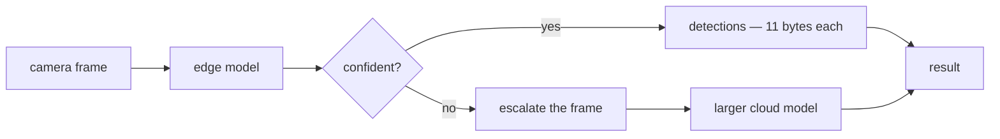

# axonmesh

[](https://github.com/dantonioluigi/axonmesh/actions/workflows/ci.yml)
[](LICENSE)


**Decide where a vision model should run — on the device, in the cloud, or
split between them — and prove the answer in bytes and mAP before deploying
it.** Then deploy it: wire protocol, cloud service, Helm chart, Kubernetes
operator.

Every configuration here is priced on **both axes at once**. That sounds
obvious and is the whole difference: measuring bandwidth against one baseline
and accuracy against another is how a design that loses looks like one that
wins. Running that discipline on this project's own premise is what produced
the two results below — one negative, one not.

### What it is for

| you want to know | run | what you get |
|---|---|---|
| does splitting cost accuracy? | `axonmesh evaluate` | baseline vs split mAP, bytes/frame |
| where should I cut? | `axonmesh plan` · `inspect` | every cut priced against a bandwidth/FPS budget |
| is edge-first cheaper than sending frames? | `axonmesh cascade` | mAP and bytes for both, on your data |
| what routing threshold should I run? | `axonmesh calibrate` | the sweep, and the one that meets your budget — no labels needed |
| what does it cost on the device? | `axonmesh benchmark` | per-stage latency, FPS, power |
| which codec size is worth it? | `axonmesh sweep` | bytes vs induced output error, Pareto-marked |
| the link quality moves — now what? | `axonmesh replan` | cut re-selection over a bandwidth trace, with hysteresis |
| now run it | `axonmesh serve` · `edge` | two processes, one TCP link, Prometheus metrics |

### The two findings that shaped it

**Compressing intermediate features loses to sending the frame.** At a rate
comparable to a JPEG, the learned codec ships *more* bytes and returns half the
mAP. `inspect` shows why in one screen: across all 23 cuts of YOLO11n the
smallest wire set is 100 KB as INT8, against 11 KB for the coded frame — no cut
of the network is smaller than the image it came from
([docs/validation.md](docs/validation.md)).

**Not sending anything wins instead.** A small model answers on the device and
the cloud is consulted only for frames it is unsure about; a confident frame
ships eleven bytes per detection. Against the honest alternative — keep sending
every frame, just send a worse one — that returns **1.5x to 8.6x the mAP at
matched bytes**, and its cheapest operating point is **38 bytes per frame for
86% of the cloud's accuracy** ([docs/cascade.md](docs/cascade.md)).

Splitting still earns its place where bandwidth was standing in for something
else: activations are not a reconstructable frame, so footage never leaves the
device; the cloud never runs the whole model; and the wire cost is identical
every frame rather than moving with scene complexity.

```bash
# cloud: small model, large model behind it for escalated frames
axonmesh serve --model yolo11n.pt --escalate-to yolo11m.pt --port 9095

# edge: answers locally when confident, escalates when not
axonmesh edge --model yolo11n.pt --images ./frames \
    --host cloud.internal --port 9095 --cascade --statistic mean
#   24 frames -> 631.6 KB on the wire (always-JPEG 1176.6 KB, saved 46.3%)
```



## Why it is not a `model[:k]` slice

A neck consumes several backbone taps through skip connections — in YOLO11,
layers 4, 6 and 10 — so a naive sequential slice silently drops tensors the
cloud half still needs. axonmesh resolves the model graph, computes the exact
*wire set* for any cut point, and runs the two halves so the split output is
**bit-identical** to the unsplit model (verified in the test suite).

Which layers exist and how to run them comes from a small **adapter contract**
(`graph` / `default_cut` / `probe_shapes` / `run_span`), so the planner, codecs,
wire protocol, policy and operator are architecture-agnostic. Ultralytics is the
first adapter, `torch.fx` is the catch-all: ResNet-18, MobileNetV3 and ViT-B/16
all split bit-identically without a line written for them.

```python
from axonmesh import SplitModel, Int8Transport

model = SplitModel(YOLO("yolo11l.pt").model)   # any adapted model
model.plan(bandwidth_mbps=50, fps=10)          # pick the cut for the link
model.split(transport=Int8Transport(compress=True))
detections = model.run(frame)                  # edge → wire → cloud
cr = model.deploy(name="detector", image="ghcr.io/you/cloud:0.8.0",
                  model_url="https://store/model.pt")   # kubectl apply this
```

## Install

```bash
git clone https://github.com/dantonioluigi/axonmesh
cd axonmesh
python -m venv .venv && source .venv/bin/activate
# CPU-only torch keeps the venv small; skip this line on machines with CUDA/Jetson
pip install torch torchvision --index-url https://download.pytorch.org/whl/cpu
pip install -e ".[dev]"
```

## Usage

**1. Inspect the architecture and price every cut point** (works with a `.pt`
checkpoint or a bare model YAML):

```bash
axonmesh inspect --model yolo11l.pt --imgsz 640
```

Prints the layer graph (with resolved skip connections) and, for every candidate
cut, which tensors must cross the wire and their fp32/fp16/int8 sizes.

**2. Measure bandwidth on real frames** — JPEG at production quality vs the
wire set produced by the edge half on the *same letterboxed pixels*:

```bash
axonmesh measure --model yolo11l.pt --images path/to/images/val \
    --quality 85 --json results/measure.json
```

**3. Measure the accuracy cost** — full validation twice on the same dataset,
unsplit vs split+INT8:

```bash
axonmesh evaluate --model yolo11l.pt --data data.yaml \
    --transport int8 --per-channel --json results/eval.json
```

**4. Train the learned bottleneck** — the piece that closes the ~30x gap. A
small per-level autoencoder is trained with the detector frozen and simulated
INT8 noise on the latents; with the defaults (`--latent-channels 8 --stride 2`)
the INT8 latent is ~17 KB/frame vs ~47 KB of JPEG q85. Half the loss is taken
on the *head output* rather than the reconstructed features
(`--task-weight`), which is worth ~39% relative mAP at identical wire cost —
see [docs/validation.md](docs/validation.md), including what it does not yet
buy:

```bash
# where should the latent budget go? measured, no training needed
axonmesh allocate --model yolo11l.pt --images path/to/images/train
#   proposed --latent-channels 4:3,6:13,10:65  (same bytes, redistributed)

axonmesh train-bottleneck --model yolo11l.pt \
    --images path/to/images/train --device 0 \
    --latent-channels 4:3,6:13,10:65 --out bottleneck.pt
axonmesh evaluate --model yolo11l.pt --data data.yaml \
    --bottleneck bottleneck.pt --json results/eval_bottleneck.json
```

`allocate` exists because one latent width for every wire level spends the
budget where the pixels are, not where the accuracy is: on YOLO11n the
shallowest level takes 72% of the bytes and causes 22% of the damage, while the
deepest takes 6% and causes 47%. It coarsens each level in turn and reports what
the model's output does, so the split is measured rather than guessed.

`train-bottleneck` holds frames out before the first step and closes with the
error the codec induces on the model's output over those frames — the number
that tracks mAP. Per-level reconstruction error still prints, marked as the
diagnostic it is; it can improve while accuracy gets worse, and did.

No GPU locally? [notebooks/colab_validation.ipynb](notebooks/colab_validation.ipynb)
runs this on COCO (train2017 → val2017) on a free Colab GPU.

**5. Price edge-first inference** — the configuration that wins on bandwidth.
A small model answers on the device; the cloud is consulted only for frames it
is unsure about. Reports mAP *and* bytes so the trade is visible, not asserted:

```bash
axonmesh cascade --edge yolo11n.pt --cloud yolo11m.pt \
    --data coco128.yaml --imgsz 320 --conf-high 0.6 --statistic mean
```

`--statistic` chooses how a frame's detections become the one confidence the
threshold is applied to. The default `min` escalates if *any* object is
doubtful, which fits a station holding a few known objects and is close to a
constant on a crowded scene — on coco128 it escalates 78% of frames for the
same mAP `mean` gets from 68%.

**Pick the threshold by measuring it, not by guessing.** A detector's score is
not a probability: 0.6 does not mean "right six times in ten", and the mapping
shifts between models and scenes. `calibrate` runs both models over frames from
the deployment and asks *would the cloud have disagreed?* — which needs **no
labels**, only footage from the camera that will be running:

```bash
axonmesh calibrate --edge yolo11n.pt --cloud yolo11m.pt \
    --images ./footage --imgsz 320 --statistic mean --max-kb 5
#   chosen --conf-high 0.60  (4.677 KB/frame, agreement 0.951, escalates 41%)
```

Give it a bandwidth ceiling and it returns the most faithful threshold that
fits; give it an agreement floor and it returns the cheapest that clears it. On
public data the label-free sweep picks the same threshold the labelled mAP
measurement did.

**5b. Simulate the adaptive stream** — the same routing offline, with the
feature path available and hard frames enqueued for later use:

```bash
axonmesh stream --model yolo11l.pt --images path/to/images/val \
    --bottleneck bottleneck.pt --json results/stream.json
```

**6. Benchmark a configuration** — accuracy, throughput, bandwidth and latency
only mean something together: a cut that halves the bytes is worthless if it
doubles the edge latency. One command reports them per stage:

```bash
axonmesh benchmark --model yolo11l.pt --images path/to/frames \
    --transport int8 --compress --device 0 --json results/bench.json
# add --data data.yaml to also measure the mAP cost (slower)
```

```
| metric                  | value          |
| latency total           | 295.0 ms       |
|   · edge half           | 94.6 ms        |
|   · wire (encode+codec) | 104.2 ms       |
|   · cloud half          | 93.6 ms        |
| throughput              | 3.4 FPS        |
| wire                    | 577.7 KB/frame |
| wire vs JPEG            | 0.17x          |
| bandwidth needed        | 16.0 Mbps      |
```

Power is included on boards that expose it (Jetson INA3221 rails).

Everything is also available as a library:

```python
from ultralytics import YOLO
from axonmesh import SplitRunner, Int8Transport, split_inference

yolo = YOLO("yolo11l.pt")
runner = SplitRunner(yolo.model, transport=Int8Transport(axis=1))
detections = runner(x)                  # edge -> quantise -> wire -> cloud
print(runner.stats.mean_bytes)          # bytes/frame that crossed the wire

with split_inference(yolo.model, transport=Int8Transport()) as runner:
    yolo.val(data="data.yaml")       # standard ultralytics val, split underneath
```

## Run it over the network

The cloud half runs as a service; the edge connects to it. The wire protocol
carries three payload kinds — serialised detections, quantised feature tensors,
and full JPEG frames — chosen per frame by the policy. FRAME uploads can be
queued as hard-frame samples with `serve --retrain-dir /retrain`.

A HELLO/ACK handshake settles what the two ends have to agree on, and that
depends on the **role**:

```bash
# split: two halves of one network. Identical weights are mandatory, because
# halves on different weights produce confidently wrong output and nothing
# else would catch it. Mismatches are rejected at connect time.
axonmesh serve --model yolo11l.pt --bottleneck bottleneck.pt --port 9095
axonmesh edge  --model yolo11l.pt --bottleneck bottleneck.pt \
    --host <cloud-host> --port 9095 --images path/to/frames

# cascade: two independent models. Differing weights are the entire point, so
# only the protocol, role and image size are compared.
axonmesh serve --model yolo11n.pt --escalate-to yolo11m.pt --port 9095
axonmesh edge  --model yolo11n.pt --host <cloud-host> --port 9095 \
    --images path/to/frames --cascade --statistic mean
```

Roles cannot be mixed: a split client talking to a cascade server fails at
connect, because the two ends would disagree about what the fingerprints mean.
Under `--cascade` an escalation always ships the frame — the cloud runs a
*different* model and cannot consume this one's activations, and the server
refuses feature payloads rather than answering with the wrong half.

`/metrics` shows the routing as it happens:

```
axonmesh_frames_total{mode="detections"} 11
axonmesh_frames_total{mode="frame"} 13
axonmesh_wire_bytes_total{mode="detections"} 286
axonmesh_wire_bytes_total{mode="frame"} 646028
```

## Deploy on Kubernetes

`deploy/` ships Dockerfiles for both halves and a Helm chart for the cloud
half. The images are model-agnostic (weights are provided at runtime, not
baked in), so a single build serves any checkpoint:

```bash
helm install detector deploy/helm/axonmesh-cloud \
    --set image.repository=ghcr.io/you/axonmesh-cloud \
    --set model.url=https://your-store/model.pt \
    --set model.sha256=$(sha256sum model.pt | cut -d' ' -f1) \
    --set bottleneck.url=https://your-store/bottleneck.pt
```

An initContainer downloads the checkpoint (or mount a PVC via
`model.existingClaim`); the pod exposes the wire port plus `/healthz` and
Prometheus `/metrics` (set `serviceMonitor.enabled=true` with the Prometheus
Operator). Point edge devices at the resulting Service DNS name.

**Set `model.sha256`.** `torch.load` unpickles the checkpoint, so whatever that
URL serves is code that runs in the pod. The weight fingerprint in the
handshake catches *mismatched* halves, but it is computed after loading —
too late to be a defence against a swapped file.

### One command, then a resource

```bash
helm install axonmesh-operator deploy/helm/axonmesh-operator
kubectl apply -f operator/examples/cascade.yaml
```

The chart brings the CRD, the RBAC and the controller; the images are published
by CI to `ghcr.io/dantonioluigi/axonmesh-{cloud,edge,operator}`, so nothing has
to be built first.

**What this does and does not give you.** If an object detector already runs
inside your cluster and clients POST it frames, installing this changes
nothing — the saving comes from work moving to the device, and the device has
to participate. The case it is for is *frames arriving from outside the
cluster*: cameras or gateways running `axonmesh edge`, answering locally when
confident and escalating when not. Then the cluster side is one resource, and
the wire drops by the escalation rate.

Scaling follows from that: the cloud half's load is the escalation traffic of
every edge pointed at it, which moves with the scenes those cameras look at
rather than with anything in the cluster. `cloud.autoscaling` hands the replica
count to an HPA; a fixed number is either waste or a queue, and which one it is
changes during the day.

### Operator (declarative)

For fleets, `operator/` provides a `SplitInference` custom resource and a kopf
controller that manages the cloud Deployment/Service and an edge-facing
ConfigMap for you:

```yaml
apiVersion: axonmesh.dev/v1alpha1
kind: SplitInference
metadata: { name: detector }
spec:
  model: { url: https://your-store/model.pt }
  bottleneck: { url: https://your-store/bottleneck.pt }
  cut: { mode: auto, auto: { bandwidthMbps: 50, fps: 10 } }
  cloud: { image: ghcr.io/you/axonmesh-cloud:0.5.0, replicas: 2 }
```

Declaring `escalateTo` makes it a **cascade** instead — the operator writes
`role=cascade` into the edge ConfigMap and passes `--escalate-to` to the cloud,
so the winning configuration is as declarative as the split one
([operator/examples/cascade.yaml](operator/examples/cascade.yaml)):

```yaml
spec:
  model: { url: https://store/yolo11n.pt, sha256: "..." }
  escalateTo: { url: https://store/yolo11m.pt, sha256: "..." }
  policy: { confHigh: 0.6, statistic: mean }   # from `axonmesh calibrate`
```

Set `sha256` on every download. `torch.load` unpickles the checkpoint, so the
URL is code that runs in the pod, and the initContainer refuses a digest
mismatch rather than starting on a file nobody vouched for.

`cut.mode: fixed` pins a layer; `auto` writes the budget into the edge
ConfigMap for the edge to plan against live (`axonmesh replan`). Install the
CRD + RBAC from `operator/manifests/`, run the operator (image in
`operator/Dockerfile`), and `kubectl apply` the resource. The reconcile logic
is pure and unit-tested; `deploy/kind/e2e.sh` exercises it end-to-end on a kind
cluster (also run in CI).

## Not just YOLO / not just Jetson

The specifics are seams, not assumptions:

- **Model** — a `ModelAdapter` answers four questions (`graph`, `default_cut`,
  `probe_shapes`, `run_span`) and registers a detector; `SplitModel(model)` then
  resolves one automatically. `UltralyticsAdapter` reads YOLO's wiring;
  **`FxAdapter` handles anything else traceable** by recovering the graph with
  `torch.fx`, so it is the fallback for arbitrary models. Verified end to end
  (bit-identical split, INT8 wire) on:

  | model | backend | layers | split exact |
  |---|---|---:|---|
  | YOLO11 | ultralytics | 24 | ✅ |
  | ResNet-18 | torch.fx | 70 | ✅ |
  | MobileNetV3-Small | torch.fx | 158 | ✅ |
  | ViT-B/16 | torch.fx | 235 | ✅ |

  A purpose-built adapter always beats the fallback: registrations sort ahead of
  it, so adding a family is a `register_adapter(...)` call, not a fork. Models
  that assert on input shape (torchvision's ViT) can be traced by the caller and
  handed over as a `GraphModule`.
- **Task** — the wire carries *opaque* result bytes, so a different head plugs
  in by replacing the server's `postprocess` (YOLO NMS is only the default).
- **Edge device** — "edge" is any host that runs the first half and speaks the
  protocol. Jetson is the reference target, but the edge image is plain Python
  and builds for amd64/arm64 alike.
- **Transport** — raw / INT8 / learned bottleneck are pluggable `Transport`
  objects; a new codec is one class implementing the wire round-trip.

## Results

Every number below is printed by a command in this repo, and every claim is
paired with the command that produced it. Byte counts are hardware-independent;
**latency is not** — measure it on the device you will deploy on.

### 1. Intermediate tensors are far bigger than the picture

`axonmesh measure`, YOLO11l @640, backbone cut (wire set = layers 4/6/10):

| what crosses the wire | KB/frame | vs JPEG q85 |
|---|---:|---:|
| JPEG q85, letterboxed (baseline) | 47.1 | 1.0x |
| fp32 tensors | 16 800 | 357x **larger** |
| fp16 tensors | 8 400 | 178x **larger** |
| INT8 per-tensor | 4 200 | 89x **larger** |
| INT8 per-tensor + zlib | 1 406 | 30x **larger** |

This is the gap a learned codec has to close for feature shipping to beat frame
shipping. It is also only half a comparison — which is the trap.

### 2. Both axes together: the codec does not close it

`axonmesh evaluate`, yolo11n @320. Codec rows trained on COCO val2017 and
evaluated on coco128, which share no images:

| what crosses the wire | KB/frame | mAP50-95 |
|---|---:|---:|
| JPEG q50 frame, cloud runs everything | 11.3 | **0.385** |
| raw INT8 wire tensors | 273 | 0.385 |
| learned bottleneck, 8 latent channels | 3.8 | 0.154 |
| learned bottleneck, 32ch, measured allocation | 14.1 | 0.195 |

Sending a frame costs bandwidth and nothing else — the cloud then runs the
unsplit model, so it is the baseline accuracy by construction. At a
JPEG-comparable rate the codec ships more bytes and returns half the accuracy,
and 3.7x the wire buys 0.041 mAP: the curve is flat, so no reachable rate
closes it.

Longer training (asymptotic), 50x the data at matched compute (10%), 4x the
latent width (4%) and a measured per-level bit allocation (4%) were each tried
and each quantified — [docs/validation.md](docs/validation.md).

### 3. What wins: not sending anything

`axonmesh cascade`, yolo11n escalating to yolo11m, coco128 @320. The honest
alternative is not "raw tensors" but "keep sending every frame, just send a
worse one", so both curves trade accuracy for bandwidth and the question is
which dominates:

| KB/frame | cascade | JPEG-quality-only |
|---:|---:|---:|
| 0.04 | **0.385** | — (no frame fits) |
| ~3.2 | **0.412** | 0.048 |
| ~5.0 | **0.440** | 0.152 |
| ~7.0 | **0.436** | 0.294 |
| ~11.2 | 0.448 | 0.448 |

One curve is above the other at every rate. The mechanism is asymmetric damage:
the edge answers easy frames on the **original** image, while turning the JPEG
quality down degrades every frame, including the ones that needed nothing.

Live over TCP, 24 frames, `conf_high=0.6`: 631.6 KB against 1176.6 KB
always-JPEG — 46% saved, matching what the offline measurement predicted for
that threshold. Caveats, the threshold sweep and a pre-registered criterion that
was *not* met: [docs/cascade.md](docs/cascade.md).

## Roadmap

- [x] Graph-aware splitter, bit-exact split inference (0.1.0)
- [x] INT8 wire + bandwidth/accuracy measurement (0.1.0) → finding: raw INT8
      loses to JPEG by ~30x at the backbone cut
- [x] Learned bottleneck at the cut, trained by feature distillation (0.2.0)
- [x] Adaptive transmission policy + stream simulator with hard-frame queue (0.2.0)
- [x] Cut planner: pick the split point from a bandwidth/FPS budget (0.3.0)
- [x] Bottleneck sweep: bytes-vs-mAP Pareto tooling (0.4.0)
- [x] Real network split + wire protocol + Docker/Helm deploy (0.5.0)
- [x] Live re-planning: bandwidth/load-driven cut selection with hysteresis (0.6.0)
- [x] Kubernetes operator: `SplitInference` CRD, kopf controller, kind e2e
- [x] Backbone-agnostic split: adapter contract + generic `torch.fx` splitter,
      verified bit-identical on ResNet-18, MobileNetV3 and ViT-B/16 (0.7.0)
- [x] Train the bottleneck against the head output → +39% relative mAP at the
      same wire cost, and the finding that reconstruction error is not a proxy
      for accuracy ([docs/validation.md](docs/validation.md))
- [x] Price both axes against the same row → **feature compression loses to
      sending the frame**, and no cut of the network is smaller than the image
      it came from. Longer training, 50x the data, 4x the latent width and a
      measured bit allocation are each quantified and none of them close it
- [x] Edge-first cascade, offline and live: 1.5–8.6x the mAP of the obvious
      alternative at matched bytes, running over the wire protocol with role
      negotiation ([docs/cascade.md](docs/cascade.md))
- [x] Cascade on the operator: `spec.escalateTo` reconciles the escalation
      model and derives the role, so the winning configuration is declarative;
      downloads are digest-verified and the URL cannot smuggle shell into the
      initContainer
- [x] Label-free threshold calibration (`axonmesh calibrate`): measure what
      each threshold does to agreement and bytes on unlabelled deployment
      footage, and pick the one that meets a budget. Reproduces the labelled
      choice on public data
- [ ] Task-head plugins beyond YOLO NMS, so the cloud half serves segmentation
      and classification heads without a fork

The full gated plan is in [docs/roadmap.md](docs/roadmap.md); the experimental
method in [docs/experiment-protocol.md](docs/experiment-protocol.md); repo
upkeep in [docs/maintenance.md](docs/maintenance.md).

## Development

```bash
pytest                 # runs with coverage (fails under 85%)
ruff check . && ruff format --check .
pre-commit install     # optional: run the same checks on every commit
```

Tests build YOLO11n from its bundled YAML with random weights — no downloads, no
GPU needed. YOLO11n shares its topology with the larger YOLO11 variants.

## License

[MIT](LICENSE)
