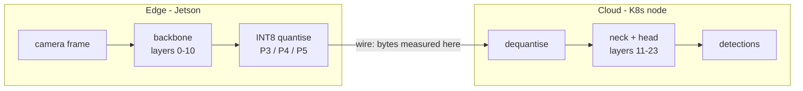

# yolo-split-computing

[](https://github.com/dantonioluigi/yolo-split-computing/actions/workflows/ci.yml)
[](LICENSE)


Split computing experiments for YOLO11 detection models: cut the network after the
backbone, run the first half on the edge device (e.g. Jetson AGX Orin), and ship
**quantised intermediate tensors** to the cloud half instead of JPEG frames.

The question this repo answers with numbers: *is transmitting the backbone output
(INT8-quantised) actually cheaper than transmitting the JPEG frame, and how much
mAP does it cost?*



## Why it is not just `model.model[:10]`

YOLO11's neck consumes the backbone taps **P3, P4 and P5** (layers 4, 6 and 10)
through skip connections, so a naive sequential slice silently drops two of the
three tensors the cloud half needs. This repo resolves the model graph
(`m.f`/`m.i` wiring), computes the exact *wire set* for any cut point, and runs
the two halves so that the split output is **bit-identical** to the unsplit model
(verified in the test suite).

## Install

```bash
git clone https://github.com/dantonioluigi/yolo-split-computing
cd yolo-split-computing
python -m venv .venv && source .venv/bin/activate
# CPU-only torch keeps the venv small; skip this line on machines with CUDA/Jetson
pip install torch torchvision --index-url https://download.pytorch.org/whl/cpu
pip install -e ".[dev]"
```

## Usage

**1. Inspect the architecture and price every cut point** (works with a `.pt`
checkpoint or a bare model YAML):

```bash
yolosplit inspect --model teacher_best.pt --imgsz 640
```

Prints the layer graph (with resolved skip connections) and, for every candidate
cut, which tensors must cross the wire and their fp32/fp16/int8 sizes.

**2. Measure bandwidth on real frames** — JPEG at production quality vs the
wire set produced by the edge half on the *same letterboxed pixels*:

```bash
yolosplit measure --model teacher_best.pt --images datasets/kitting_v4/images/val \
    --quality 85 --json results/measure.json
```

**3. Measure the accuracy cost** — full validation twice on the same dataset,
unsplit vs split+INT8:

```bash
yolosplit evaluate --model teacher_best.pt --data kitting_v4.yaml \
    --transport int8 --per-channel --json results/eval.json
```

Everything is also available as a library:

```python
from ultralytics import YOLO
from yolosplit import SplitRunner, Int8Transport, split_inference

yolo = YOLO("teacher_best.pt")
runner = SplitRunner(yolo.model, transport=Int8Transport(axis=1))
detections = runner(x)                  # edge -> quantise -> wire -> cloud
print(runner.stats.mean_bytes)          # bytes/frame that crossed the wire

with split_inference(yolo.model, transport=Int8Transport()) as runner:
    yolo.val(data="kitting_v4.yaml")    # standard ultralytics val, split underneath
```

## Results

First measurement — YOLO11l (`teacher_best.pt`), 12 kitting_v4 frames, 640×640,
backbone cut (layer 10, wire set = P3/P4/P5, i.e. layers 4/6/10):

| configuration | wire KB/frame (mean) | vs JPEG q85 |
|---|---:|---:|
| JPEG q85, letterboxed @640 (baseline) | 47.1 | 1.0x |
| fp32 tensors | 16 800 | 357x **larger** |
| fp16 tensors | 8 400 | 178x **larger** |
| INT8 per-tensor | 4 200 | 89x **larger** |
| INT8 per-tensor + zlib | 1 406 | 30x **larger** |

**Finding:** at the backbone cut, naive quantisation does not come close: even
INT8+zlib ships ~30x more bytes than the JPEG the model would otherwise consume.
This confirms the known risk rather than killing the idea — it quantifies the
gap a **learned bottleneck at the cut** has to close (~30x on top of INT8+zlib)
for feature shipping to beat frame shipping. mAP cost of INT8 (via
`yolosplit evaluate` on kitting_v4) is only worth measuring once a bottleneck
makes the size competitive.

Latency numbers measured off-device are not representative; re-measure on the
Jetson before drawing conclusions about end-to-end delay.

## Roadmap

This is the feasibility probe for a larger idea — adaptive split computing where
the edge modulates what it transmits based on model confidence and drift state
(detections only → quantised features → full frames for retraining). See
[docs/experiment-protocol.md](docs/experiment-protocol.md) for the experimental
protocol and where this is headed (learned bottleneck, dynamic split point,
Kubernetes operator).

## Development

```bash
pytest                 # runs with coverage (fails under 85%)
ruff check . && ruff format --check .
pre-commit install     # optional: run the same checks on every commit
```

Tests build YOLO11n from its bundled YAML with random weights — no downloads, no
GPU needed. YOLO11n shares its topology with the YOLO11l used in production.

## License

[MIT](LICENSE)
