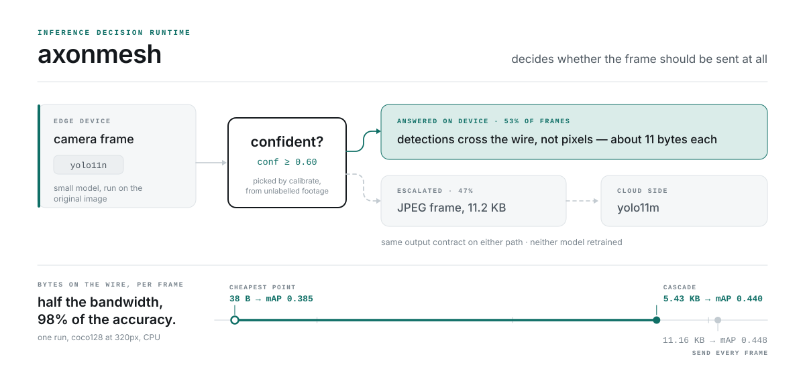
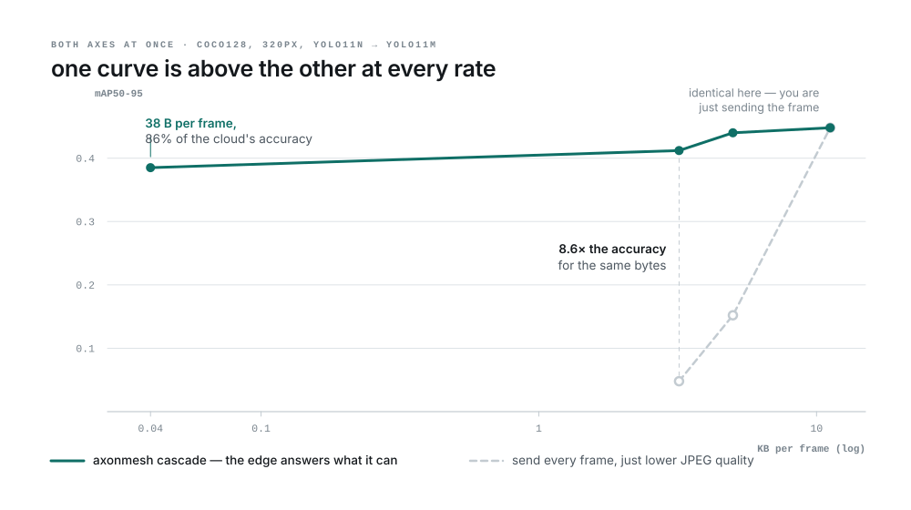

<h1 align="center">axonmesh</h1>

<p align="center"><b>An inference decision runtime for edge–cloud AI.</b></p>

<p align="center">
  <a href="https://github.com/dantonioluigi/axonmesh/actions/workflows/ci.yml"></a>
  <a href="LICENSE"></a>
  
  
  <a href="https://colab.research.google.com/github/dantonioluigi/axonmesh/blob/main/notebooks/cascade_quickstart.ipynb"></a>
</p>

<p align="center">
  <picture>
    <source media="(prefers-color-scheme: dark)" srcset="docs/assets/hero-dark.svg">
    
  </picture>
</p>

Serving systems answer *how fast can we serve this request*. axonmesh answers
*whether the request needs the expensive model at all* — and proves the answer
in bytes, compute and accuracy before you deploy it.

A small model answers the requests it is sure of; only the rest reach the large
one. Whatever the small model handles is bytes the network never carries **and**
work the accelerator never does — so the *same* routing saves **bandwidth when
the cameras are outside the cluster, and compute when they are inside it.** You
don't choose which; you measure which one your deployment gets.

One run, one dataset — yolo11n → yolo11m, coco128 at 320px, threshold chosen by
`calibrate` from unlabelled footage, neither model retrained:

- **GPU compute** — the large model is the one that needs the accelerator, and
  it runs on only the 48% of frames that escalate: **52% of its inferences
  avoided**, at 98% of its accuracy. That is capacity, not a micro-benchmark —
  the expensive tier serves the same stream on **~half the GPUs**, or twice the
  stream on the GPUs you have. And the share is the routing's, not the
  hardware's: **52% on a laptop CPU and 52% on a Tesla T4**, unchanged while the
  per-inference cost drops 28x (250 ms → 9 ms).
- **Bandwidth** — when the cameras are outside the cluster, the frames that skip
  the GPU also skip the network: **5.43 against 11.16 KB per frame** at
  mAP50-95 0.440 vs 0.448. Half the wire, 98% of the accuracy.

It is the cost lever LLM stacks already pull — a cheap model first, the
expensive one only when it is needed — brought to vision, with the routing
threshold **measured instead of guessed** and audited in production. Don't take
either number on faith:
[reproduce both in the browser](https://colab.research.google.com/github/dantonioluigi/axonmesh/blob/main/notebooks/cascade_quickstart.ipynb),
no GPU or device required.

## Quick start

Requires Python 3.10–3.12 and PyTorch. A GPU, a Kubernetes cluster and a real
device are all optional — every command below runs on a laptop.

```bash
git clone https://github.com/dantonioluigi/axonmesh
cd axonmesh
pip install -e .          # or: helm install axonmesh-operator deploy/helm/axonmesh-operator
```

```bash
# what threshold fits a 5 KB/frame link? no labels needed
axonmesh calibrate --edge yolo11n.pt --cloud yolo11m.pt --images ./footage --max-kb 5
#   chosen --conf-high 0.60  (4.677 KB/frame, agreement 0.951, escalates 41%)

# cloud: the large model, behind the small one
axonmesh serve --model yolo11n.pt --escalate-to yolo11m.pt --port 9095

# device: answers locally when confident, escalates when not
axonmesh edge --model yolo11n.pt --images ./frames --cascade --statistic mean \
    --host cloud.internal --port 9095
#   24 frames -> 631.6 KB on the wire (always-JPEG 1176.6 KB, saved 46.3%)
```

Already running KServe or Triton? Skip `axonmesh serve` and point the
escalation at the predictor you have — and let the audit keep proving, on live
traffic and without labels, that the routing is still safe (same 24 frames;
the audited frames are billed, which is why the saving reads lower):

```bash
axonmesh edge --model yolo11n.pt --images ./frames \
    --escalate-url http://predictor.internal:8080 \
    --audit 0.25 --audit-floor 0.90 --metrics-port 9186
#   24 frames -> 831.1 KB on the wire (always-JPEG 1176.6 KB, saved 29.4%)
#   audit: 4 confident frames re-checked against the cloud, rolling agreement 1.000
```

`--escalate-format oip` speaks the Open Inference Protocol (KServe V2 /
Triton); the default is a minimal JPEG-in/JSON-out contract. Routing, bytes
and the rolling agreement are Prometheus series while the run is live.

## What it decides, and with what

| you want to know | run | what you get |
|---|---|---|
| should frames be sent at all? | `cascade` | bytes and mAP for edge-first vs sending everything |
| which frames? | `calibrate` | the threshold meeting your bandwidth or accuracy budget, from unlabelled footage |
| does splitting the model cost accuracy? | `evaluate` | baseline vs split mAP, bytes/frame |
| where would you cut it? | `plan` · `inspect` | every cut priced against a bandwidth/FPS budget |
| what does it cost on the device? | `benchmark` | per-stage latency, FPS, power |
| how big should the codec be? | `sweep` · `allocate` | bytes vs induced output error, Pareto-marked |
| the link quality moves? | `replan` | cut re-selection with hysteresis |
| is the routing still safe, months later? | `edge --audit` | live agreement with the cloud on confident frames — the production continuation of `calibrate` |
| cameras already inside the cluster? | `cascade` | share of the large model's compute the routing avoids, both models on one clock |
| now run it | `serve` · `edge` | axonmesh's own TCP server, or any HTTP predictor via `--escalate-url` — Prometheus metrics at both ends |

Full walkthrough: **[docs/usage.md](docs/usage.md)**.

## Results

Existing systems optimise either bandwidth or accuracy. Pricing one against a
baseline and the other against a different baseline is how a design that loses
looks like one that wins — so everything here is measured on both at once.
Applied to this project's own founding premise, that produced two results, one
of which refutes it.

### The premise was wrong: compressing intermediate features loses to sending the frame

yolo11n at 320px; codec rows trained on COCO val2017 and evaluated on coco128,
which share no images:

| what crosses the wire | KB/frame | mAP50-95 |
|---|---:|---:|
| JPEG q50 frame, cloud runs everything | 11.3 | **0.385** |
| raw INT8 wire tensors | 273 | 0.385 |
| learned bottleneck, 8 latent channels | 3.8 | 0.154 |
| learned bottleneck, 32ch, measured allocation | 14.1 | 0.195 |

At a JPEG-comparable rate the codec ships *more* bytes and returns half the
accuracy. `inspect` shows why in one screen: across all 23 cuts of YOLO11n the
smallest wire set is 100 KB as INT8 against 11 KB for the coded frame — no cut
of the network is smaller than the image it came from. Longer training, 50x the
data, 4x the latent width and a measured bit allocation were each tried and each
quantified; none of them close it.

### What wins instead: not sending anything

Against the honest alternative — keep sending every frame, just send a worse one:

<p align="center">
  <picture>
    <source media="(prefers-color-scheme: dark)" srcset="docs/assets/results-dark.svg">
    
  </picture>
</p>

| KB/frame | cascade | JPEG-quality-only |
|---:|---:|---:|
| 0.04 | **0.385** | — (no frame fits) |
| ~3.2 | **0.412** | 0.048 |
| ~5.0 | **0.440** | 0.152 |
| ~11.2 | 0.448 | 0.448 |

One curve is above the other at every rate, by **1.5x to 8.6x**, and the
cheapest point ships **38 bytes per frame for 86% of the cloud's accuracy**. The
mechanism is asymmetric damage: the edge answers easy frames on the *original*
image, while lowering JPEG quality degrades every frame including the ones that
needed nothing.

The same routing has a second reading for cameras *inside* the cluster, where
bytes are free and the accelerator is not: the large model only runs on
escalated frames, so the routing **avoids 52% of its compute** — timed on one
clock in the same run. And that share is a property of the routing, not the
accelerator: measured in the same configuration on a laptop CPU and a Tesla T4
it does not move (**52% both**) while the per-inference cost collapses from
**250 ms to 9 ms**. The saving is a decision, not a hardware trick
([docs/cascade.md](docs/cascade.md)).

Both in full, with the caveats and a pre-registered criterion that was *not*
met: **[docs/validation.md](docs/validation.md)** · **[docs/cascade.md](docs/cascade.md)**.

## Where it sits next to what you already run

Not another serving runtime, and it does not replace one — it answers the
question that comes *before* serving.

| | what it does | what it takes as given |
|---|---|---|
| KServe · Triton · BentoML | serve a model behind an endpoint, scale it, version it | the input already arrived |
| Ray Serve | compose and scale Python inference across a cluster | you decided what runs where |
| vLLM · SGLang · TensorRT-LLM | make one model fast on the accelerators it is given | the work is in the cluster |
| **axonmesh** | **decide which requests need the expensive model at all, priced in bytes, compute and accuracy** | **nothing — it produces that decision** |

Put a cascade in front of KServe and both are doing their job: KServe serves
the large model on a GPU, axonmesh answers the easy requests with a cheap model
first so **the GPU tier runs on half the traffic** — the same cost lever people
already pull with LLMs (small model first, GPT-4 only when needed), here with
the routing threshold *measured* instead of guessed and audited in production.
That is a working path, not a diagram — `edge --escalate-url` speaks the Open
Inference Protocol (KServe V2 / Triton) or a plain JPEG-in/JSON-out contract, and
`--audit` keeps re-measuring, on live traffic and without labels, the
agreement `calibrate` measured once ([docs/deployment.md](docs/deployment.md)).

## Not a `model[:k]` slice, and not only YOLO

A neck consumes several backbone taps, so a naive sequential slice silently
drops tensors the second half needs. axonmesh resolves the graph, computes the
exact *wire set* for any cut, and the split output is **bit-identical** to the
unsplit model. Model family, task head, transport and edge device are all seams
behind small contracts — `torch.fx` is the catch-all backend, and ResNet-18,
MobileNetV3 and ViT-B/16 split bit-identically with no code written for them.

**[docs/architecture.md](docs/architecture.md)** · **[docs/deployment.md](docs/deployment.md)**

## Scope

It splits a network in **two** and routes between two models. There is no
multi-hop, no device discovery, no NPU backend and no fault tolerance. The
*bandwidth* saving needs cameras outside the cluster, and the device has to
participate — traffic that already arrives as full frames is not made cheaper
by installing anything. For cameras inside the cluster the saving is compute,
not bytes: the small model has to run somewhere cheaper than the accelerator
it is shielding, or there is nothing to save.

## Documentation

| | |
|---|---|
| [docs/usage.md](docs/usage.md) | every command, in the order you would run them |
| [docs/cascade.md](docs/cascade.md) | edge-first inference: the measurement, the threshold sweep, the caveats |
| [docs/validation.md](docs/validation.md) | why feature compression loses, and everything tried to save it |
| [docs/architecture.md](docs/architecture.md) | graph-aware splitting, adapters, what is pluggable |
| [docs/deployment.md](docs/deployment.md) | wire protocol, roles, Helm, the Kubernetes operator |
| [docs/roadmap.md](docs/roadmap.md) | what is done, what is next, what was tried and dropped |
| [docs/experiment-protocol.md](docs/experiment-protocol.md) | how a claim in this repo is allowed to be made |

## Development

```bash
pytest                 # runs with coverage (fails under 85%)
ruff check . && ruff format --check .
pre-commit install     # the same checks on every commit
```

Tests build YOLO11n from its bundled YAML with random weights — no downloads,
no GPU, no dataset. The Kubernetes e2e (`deploy/kind/e2e.sh`) builds the
operator image and installs it with the chart on a kind cluster, because
running it any other way hid three bugs at once.

Contributions welcome — see [CONTRIBUTING.md](CONTRIBUTING.md).

## License

axonmesh's own code is **Apache-2.0** — see [LICENSE](LICENSE) and
[NOTICE](NOTICE). The patent grant and the ecosystem it shares with the
serving stacks above are why it is Apache rather than MIT.

**One dependency is copyleft, and it is a core one.** The default install and
every measured result here use **ultralytics** (the YOLO backend), which is
**AGPL-3.0-or-later**. Your use of *this* project's code is Apache-2.0, but
combining or distributing it with ultralytics — or serving it over a network,
which the `serve`/operator path does — subjects that combination to the
AGPL-3.0. A permissive licence on our files does not lift that; it is the
dependency's licence, and it travels.

If the AGPL does not suit you, three honest routes: install only the
`torch.fx` backend (`axonmesh.adapters.fx` does not import ultralytics — a
deployment without ultralytics is not AGPL-bound, though it also does not run
the YOLO models the benchmarks use), obtain an
[ultralytics enterprise licence](https://www.ultralytics.com/license), or use
a permissively licensed detector behind the adapter contract.
