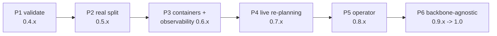

# Roadmap: from feasibility probe to a generic split-computing platform

Where the project goes after v0.3.0, in gated phases. Each phase has an exit
criterion — a number or a working artifact — and nothing in a later phase
starts until the gate before it is passed. Versions are indicative.

## Phase 1 — Validate the numbers (v0.4.x)

The bottleneck exists but is untrained; everything after this phase builds on
its numbers being good.

- Train the bottleneck on GPU on the full training set; measure ΔmAP with
  `evaluate --bottleneck` on the validation split.
- **Configuration sweep** (`axonmesh sweep`): latent channels {4, 8, 16} ×
  stride {1, 2, 4} × {per-tensor, per-channel} × {±zlib} → Pareto curve of
  wire bytes vs mAP. Store results as JSON, render the curve in the README.
- Try one non-backbone cut (e.g. after the first neck stage) — the planner
  says later cuts ship fewer bytes; check what they cost in edge compute.

**Gate:** a configuration with wire bytes < JPEG at ≤ 1–2 points of mAP50-95
lost. If nothing passes, stop and publish the negative result.

## Phase 2 — From simulation to a real split (v0.5.x)

Everything so far runs in one process. Make the wire real.

- **Wire protocol v1**: framed messages over TCP (length-prefixed):
  `FrameHeader` (frame id, mode, cut, model/bottleneck fingerprints,
  timestamps) + payload (serialised detections | latents | JPEG). Versioned:
  header carries a protocol version byte; mismatches fail loudly. The
  fingerprints prevent the silent nightmare: edge and cloud running different
  weights.
- **`axonmesh serve` (cloud)**: receives latents → decodes → runs neck/head →
  returns detections. Also accepts FRAME messages (full inference + enqueue to
  the hard-frame store).
- **`axonmesh edge`**: source (directory/camera/RTSP) → local inference →
  policy → transport → send; falls back to local-only when the link is down
  (degraded mode: detections logged, hard frames buffered on disk).
- **On-device benchmark** (`axonmesh bench`): per-stage timings on the edge —
  backbone ms, encode ms, serialise ms, send ms — the latency numbers the
  README currently refuses to fake.
- **ONNX export of the two halves** (`axonmesh export`): backbone(+encoder)
  and (decoder+)neck/head as separate ONNX graphs, so the edge half can run
  under TensorRT on Jetson and the cloud half wherever. Bit-exactness tests
  against the PyTorch halves (tolerance-based, same style as the splitter
  tests).

**Gate:** end-to-end detections over a real socket, identical (within fp
tolerance) to single-process inference; measured edge latency budget published.

## Phase 3 — Containers and observability (v0.6.x)

Deployability and the metrics every later decision consumes.

- **Images**: `cloud` (amd64, CUDA base) and `edge` (arm64, Jetson-compatible
  base), built multi-arch in CI (buildx) and pushed to GHCR on tag.
- **Helm chart** for the cloud half: Deployment + Service + optional HPA;
  model/bottleneck checkpoints mounted from an OCI artifact or PVC — values,
  not baked into the image.
- **Prometheus metrics** in both halves: bytes/frame per mode, mode counts,
  drift score, per-stage latency histograms, queue depth. Plus a Grafana
  dashboard JSON in `deploy/`.
- **Hard-frame store contract**: FRAME-mode frames land in S3-compatible
  storage with sidecar metadata (detections, confidence, drift score at
  capture). A documented layout the edge writes to — what a downstream training
  pipeline does with that dataset is out of scope (see below).

**Gate:** `helm install` on a vanilla cluster + edge container on a Jetson (or
an arm64 emulation smoke) exchanging real traffic, dashboards live.

## Phase 4 — Live re-planning (v0.7.x)

The planner exists (v0.3.0) but takes static inputs. Close the loop.

- **Bandwidth estimator**: EWMA of achieved send throughput + RTT probe;
  exposed as a metric and fed to the planner.
- **Edge load signal**: GPU/CPU utilisation (NVML / jetson-stats, pluggable).
- **Re-planning loop with hysteresis**: switch cut/transport only when the new
  plan is better by a margin *and* stable for N seconds — flapping between
  cuts is worse than a mildly suboptimal cut. Cut switches are coordinated:
  edge announces, cloud acks (both halves must agree on the wire).
- Simulator first: extend `axonmesh stream` with a scripted bandwidth trace
  (e.g. `--bandwidth-trace trace.json`) so the loop is testable in CI.

**Gate:** on a throttled link (tc/netem), the edge degrades
detections→features→frames and recovers, without manual intervention.

## Phase 5 — The Kubernetes operator (v0.8.x)

Now, and only now, the operator — it is orchestration around proven parts.

- **CRD `SplitInference`** (api group e.g. `axonmesh.dev/v1alpha1`), spec:
  - `model`: OCI artifact / URL + fingerprint
  - `bottleneck`: same, optional
  - `cut`: `fixed: N` | `auto: {budgetSource: static|prometheus, query: ...}`
  - `policy`: conf thresholds, drift config
  - `cloud`: replicas/resources; `edge`: selector for edge nodes
- **Controller in Python with kopf** (first iteration): stays in-language with
  the repo, low ceremony; a kubebuilder/Go rewrite is a possible 2.0 if the
  CRD stabilises. The controller *renders* what Phase 3 already proved: the
  Helm-equivalent resources for the cloud half + a ConfigMap the edge watches.
- **Reconcile loop**: watches the CR + Prometheus (budget source) → re-runs
  the planner → patches the edge ConfigMap (cut/transport/thresholds) → status
  subresource reports current cut, bytes/frame, drift state, retrain queue
  depth. GitOps-friendly: the operator only ever writes status and derived
  resources, never the CR spec.
- **E2E on kind in CI**: operator + cloud half + simulated edge (the stream
  simulator in a pod) + kube-prometheus stub; assert that changing the
  bandwidth metric changes the planned cut.

**Gate:** demo on kind: apply CR → system converges; change budget → cut
switches; kill cloud pod → edge degrades to local-only and recovers.

## Phase 6 — Backbone-agnostic split (v0.9.x → 1.0)

Everything above is built on the ultralytics graph reader. This phase makes the
split model-agnostic, so the wire protocol, adaptive policy, planner and
operator work for any torch vision model — not just YOLO.

- **Generic graph splitter**: trace an arbitrary `torch.nn.Module` with
  `torch.fx`, then find the cut points and the exact wire set the same way the
  ultralytics reader does today. Torchvision detectors, `timm` backbones and
  custom models get the split machinery for free.
- **Task-agnostic heads**: the wire already carries opaque result bytes; add
  reference postprocessors beyond YOLO NMS (segmentation, classification) behind
  a small registry, so a new task is a plugin rather than a fork.
- **Adapter contract**: a documented interface — `graph`, `wire set`, `cut
  options`, `postprocess` — that any model backend implements. Ultralytics
  becomes one adapter among several.
- **1.0**: wire protocol, CRD and the adapter contract declared stable; from
  here semver applies to all three.

## Out of scope (still)

- Multi-model / multi-tenant serving, GPU sharing (MIG/MPS) tuning.
- Training models and orchestrating retraining — out of scope by design; the
  edge queues hard frames (FRAME mode) to a store, but what happens to that
  dataset afterwards is left to whatever training pipeline the user already
  runs.

## Standing rules across phases

Every phase lands as PRs behind the branch protection + CI gate; every claim
in the README carries the command that produced it; anything time-related is
measured on the edge device; the wire format never changes without a protocol
version bump.
